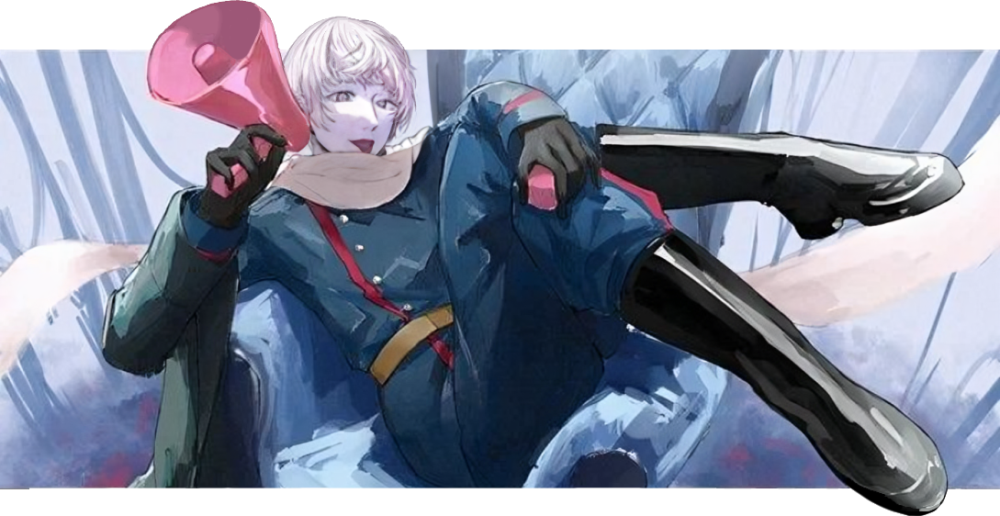

‎‎ ‎  $\color{blue}{C}$ $\color{lightblue}{O}$ $\color{blue}{L}$ $\color{red}{D}$ ‎ ‎ $\color{white}{W}$ $\color{red}{A}$ $\color{white}{R}$ ‎ ‎ ─⋆✦⋆─ ‎ ‎  $\color{white}{(1}$ $\color{white}{9}$ $\color{white}{4}$ $\color{blue}{5 - 1}$ $\color{red}{9}$ $\color{red}{9}$ $\color{red}{1)}$ ‎ ‎ 

    

 ### $\color{green}{And}$ $\color{green}{the}$ $\color{green}{universe}$ $\color{green}{said,}$ $\color{green}{❝I}$ $\color{green}{love}$ $\color{green}{you}$ $\color{green}{because}$ $\color{green}{you}$ $\color{green}{are}$ $\color{green}{love.❞}$

 $\color{cyan}{And}$ $\color{cyan}{the}$ $\color{cyan}{game}$ $\color{cyan}{was}$ $\color{cyan}{over}$ $\color{cyan}{and}$ $\color{cyan}{the}$ $\color{cyan}{player}$ $\color{cyan}{woke}$ $\color{cyan}{up}$ $\color{cyan}{from}$ $\color{cyan}{the}$ $\color{cyan}{dream.}$ $\color{cyan}{And}$ $\color{cyan}{the}$ $\color{cyan}{player}$ $\color{cyan}{began}$ $\color{cyan}{a}$ $\color{cyan}{new}$ $\color{cyan}{dream.}$ $\color{cyan}{And }$ $\color{cyan}{the}$ $\color{cyan}{player}$ $\color{cyan}{dreamed}$ $\color{cyan}{again,}$ $\color{cyan}{dreamed}$ $\color{white}{better}$. $\color{cyan}{And}$ $\color{cyan}{the}$ $\color{cyan}{player}$ $\color{cyan}{was}$ $\color{cyan}{the}$ $\color{white}{universe}$. $\color{cyan}{And}$ $\color{cyan}{the}$ $\color{cyan}{player}$ $\color{cyan}{was}$ $\color{white}{love}$.

 $\color{cyan}{You}$ $\color{cyan}{are}$ $\color{cyan}{the}$ $\color{white}{player}$.

 ### $\color{green}{Wake}$ $\color{green}{up.}$

 ‎ 
 ‎ ‎

## — $\color{white}{(BYI)}$ $\color{white}{Before}$ $\color{white}{You}$ $\color{white}{Interact}$ !！
>  -  **Boundaries can be found in my [Pronouns Page](https://en.pronouns.page/@taiyaraiya), however if something isn't listed there or you have any questions, you can always $\color{white}{ask}$ $\color{white}{me}$ $\color{white}{personally}$ ..**
>  I'm often very loose on ways of being adressed, as I don't really mind much. As long as you $\color{white}{stay}$ $\color{white}{respectful}$, you're most likely in the clear!
>  -  **I'm very sociable and interaction is encouraged, however I prefer to $\color{white}{talk}$ $\color{white}{in}$ $\color{white}{PMs}$ rather than public chat.**
>  If we happen to share some things you also like, give me a PM in-game ..
> - **I block freely**, you will $\color{white}{NOT}$ be blocked for having different viewpoints, kinning, shipping ect. unless you are purposefully derogatory towards others and/or support darkships.

---

## — $\color{white}{(Active)}$ $\color{white}{Interests}$
>  -  Life Series, Hermitcraft, Unstable Universe, STATE  
>  -  Block Tales, ORISON  
>  -  Hollow Knight
>  -  Hetalia
>  -  ARGs/puzzles, psychology, art (architecture, fashion, graphic design)

---

$\color{white}{UPDATED:}$ $\color{white}{9th}$ $\color{white}{July,}$ $\color{white}{2026.}$
