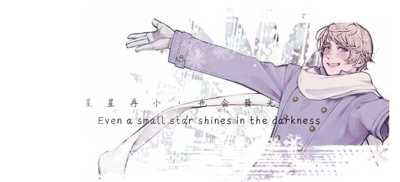

    

---

> ### ❝And the universe said I love you, because you are love.❞
>
> *And the game was over and the player woke up from the dream. And the player began a new dream. And the player dreamed again, dreamed better. And the player was the universe. And the player was love.*
>
> *You are the player.*
>
> ### *Wake up.*

---

## (BYI) Before You Interact
>  -  **Boundaries can be found in my [Pronouns Page](https://en.pronouns.page/@taiyaraiya), however if something isn't listed there or you have any questions, you can always ask me personally ..**
>  I'm often very loose on ways of being adressed, as I don't really mind much. As long as you stay respectful, you're most likely in the clear!
>  -  **I'm very sociable and interaction is encouraged, however I prefer to talk in PMs rather than public chat  (W2I, C+H+K)**
>  If we happen to share some things you also like, give me a PM in-game ..

---

## INTERESTS
>  ➜  Life Series, Hermitcraft, Unstable Universe, STATE  
>  ➜  Block Tales, SEWH, A Nostalgic Hangout Game, ORISON, Pupi's Midnight Munchies  
>  ➜  FNaF, Hetalia, Hollow Knight, ARGs/puzzles, psychology, art (architecture, fashion, graphic design)
