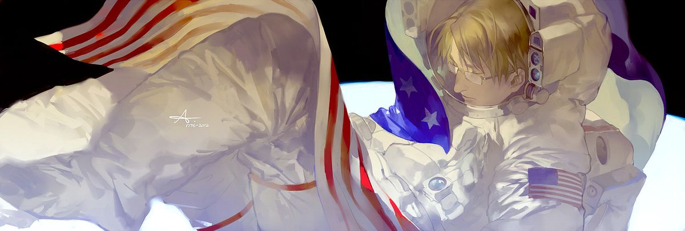

---

$\color{blue}{S}$ $\color{lightblue}{P}$ $\color{blue}{A}$ $\color{red}{C}$ $\color{red}{E}$ $\color{white}{R}$ $\color{white}{A}$ $\color{red}{C}$ $\color{red}{E}$ $\color{white}{—}$  $\color{white}{(1}$ $\color{white}{9}$ $\color{white}{5}$ $\color{blue}{5 - 1}$ $\color{red}{9}$ $\color{red}{6}$ $\color{red}{9)}$

---

    

---

> ### $\color{green}{❝And}$ $\color{green}{the}$ $\color{green}{universe}$ $\color{green}{said}$ $\color{green}{I}$ $\color{green}{love}$ $\color{green}{you,}$ $\color{green}{because}$ $\color{green}{you}$ $\color{green}{are}$ $\color{green}{love.❞}$
>
> And the game was over and the player woke up from the dream. And the player began a new dream. And the player dreamed again, dreamed $\color{white}{better}$. And the player was the $\color{white}{universe}$. And the player was $\color{white}{love}$.
>
> $\color{cyan}{You}$ $\color{cyan}{are}$ $\color{cyan}{the}$ $\color{white}{player}$.
>
> ### $\color{green}{Wake}$ $\color{green}{up.}$

---

## — $\color{white}{(BYI)}$ $\color{white}{Before}$ $\color{white}{You}$ $\color{white}{Interact}$ !！
>  -  **Boundaries can be found in my [Pronouns Page](https://en.pronouns.page/@taiyaraiya), however if something isn't listed there or you have any questions, you can always ask me personally ..**
>  I'm often very loose on ways of being adressed, as I don't really mind much. As long as you stay respectful, you're most likely in the clear!
>  -  **I'm very sociable and interaction is encouraged, however I prefer to talk in PMs rather than public chat  (W2I, C+H+K)**
>  If we happen to share some things you also like, give me a PM in-game ..
> - **I block freely**, you will **NOT** be blocked for having different viewpoints, kinning, shipping ect. unless you are purposefully derogatory towards others and/or support darkskips.

---

## ── .✦ $\color{white}{(Active)}$ $\color{white}{Interests}$
>  -  Life Series, Hermitcraft, Unstable Universe, STATE  
>  -  Block Tales, ORISON  
>  -  Hollow Knight
>  -  Hetalia
>  -  ARGs/puzzles, psychology, art (architecture, fashion, graphic design)
