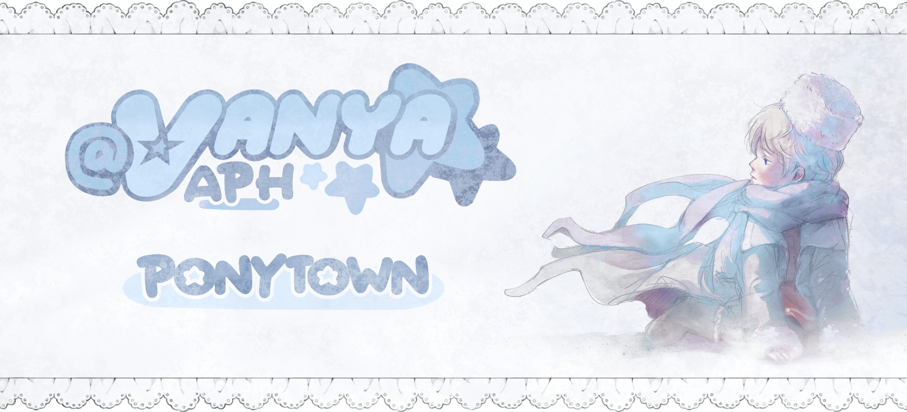
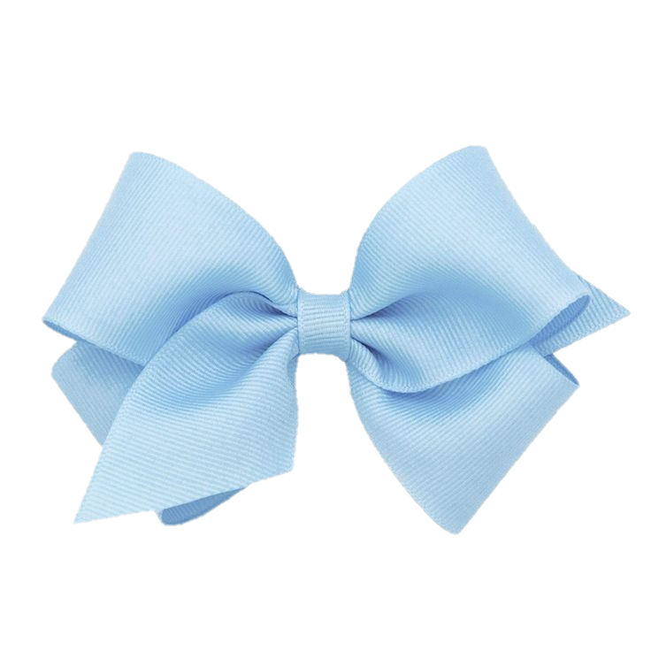

  

$\color{white}{I}$ $\color{white}{doubt}$ $\color{white}{that}$ $\color{white}{you}$ $\color{white}{would,}$ $\color{white}{even}$ $\color{white}{if}$ $\color{white}{you}$ $\color{white}{could}$ $\color{white}{change}$ 
$\color{white}{The}$ $\color{white}{things}$ $\color{white}{that}$ $\color{white}{make}$ $\color{white}{you}$ $\color{white}{special}$ $\color{white}{are}$ $\color{white}{the}$ $\color{white}{things}$ $\color{white}{that}$ $\color{white}{make}$ $\color{white}{you}$ $\color{white}{strange}$ 
  
 

 ‎ 
 ‎ ‎

 ‎

[« I wrote a story for a friend. »](https://theeggandtherock.com/p/i-wrote-a-story-for-a-friend)

 ### $\color{green}{And}$ $\color{green}{the}$ $\color{green}{universe}$ $\color{green}{said,}$ $\color{green}{❝I}$ $\color{green}{love}$ $\color{green}{you}$ $\color{green}{because}$ $\color{green}{you}$ $\color{green}{are}$ $\color{green}{love.❞}$

 $\color{cyan}{And}$ $\color{cyan}{the}$ $\color{cyan}{game}$ $\color{cyan}{was}$ $\color{cyan}{over}$ $\color{cyan}{and}$ $\color{cyan}{the}$ $\color{cyan}{player}$ $\color{cyan}{woke}$ $\color{cyan}{up}$ $\color{cyan}{from}$ $\color{cyan}{the}$ $\color{cyan}{dream.}$ $\color{cyan}{And}$ $\color{cyan}{the}$ $\color{cyan}{player}$ $\color{cyan}{began}$ $\color{cyan}{a}$ $\color{cyan}{new}$ $\color{cyan}{dream.}$ $\color{cyan}{And }$ $\color{cyan}{the}$ $\color{cyan}{player}$ $\color{cyan}{dreamed}$ $\color{cyan}{again,}$ $\color{cyan}{dreamed}$ $\color{white}{better}$. $\color{cyan}{And}$ $\color{cyan}{the}$ $\color{cyan}{player}$ $\color{cyan}{was}$ $\color{cyan}{the}$ $\color{white}{universe}$. $\color{cyan}{And}$ $\color{cyan}{the}$ $\color{cyan}{player}$ $\color{cyan}{was}$ $\color{white}{love}$.

 $\color{cyan}{You}$ $\color{cyan}{are}$ $\color{cyan}{the}$ $\color{white}{player}$.

 ### $\color{green}{Wake}$ $\color{green}{up.}$
  
 

 ‎ 
 ‎ ‎

## — $\color{white}{(BYI)}$ $\color{white}{Before}$ $\color{white}{You}$ $\color{white}{Interact}$ !！

>  -  **I'm very sociable and $\color{white}{interaction}$ $\color{white}{is}$ $\color{white}{encouraged}$, however I prefer to $\color{white}{talk}$ $\color{white}{in}$ $\color{white}{PMs}$ rather than public chat.**
>  If we happen to share some things you also like, give me a PM in-game ..
>  - I'm often very loose on ways of being adressed, as I don't really mind much. As long as you $\color{white}{stay}$ $\color{white}{respectful}$, you're most likely in the clear!
>  - If you don't like directly talking to people, you can always just leave a message on my ata or strawpages <3
>  -  **If i take a liking to you, I $\color{white}{may}$ come sit next to you if you have $\color{white}{public}$ $\color{white}{C+H}$ $\color{white}{permissions}$, otherwise I will just send a PM.**

> [!CAUTION]
>  -  $\color{white}{I}$ $\color{white}{am}$ $\color{white}{not}$ a roleplay account, fictionkin, system nor yumeshipper, I just relate and find comfort in many characters.
>  -  **$\color{white}{I}$ $\color{white}{block}$ $\color{white}{freely}$**, you will $\color{white}{NOT}$ be blocked for having different viewpoints, kinning, shipping, liking specific fandoms, ect. unless you are purposefully derogatory towards others and/or support darkships.

---

## — $\color{white}{(Active)}$ $\color{white}{Interests}$

>  -  Life Series, Hermitcraft, Unstable Universe, STATE  
>  -  Block Tales, ORISON  
>  -  Hollow Knight, Hollow Knight: SIlksong, Z.A.T.O.  
>  -  Hetalia, Hamilton  
>  -  ARGs/puzzles, psychology, architecture, graphic design & digital design, 3D modeling  
>  -  Will Wood, The Crane Wives, Laufey

---

$\color{white}{UPDATED:}$ $\color{white}{6th}$ $\color{white}{October,}$ $\color{white}{2026.}$

<!-- thanks for reading, all content from my git is free to use and you can take inspiration off of it !! <3 -->
